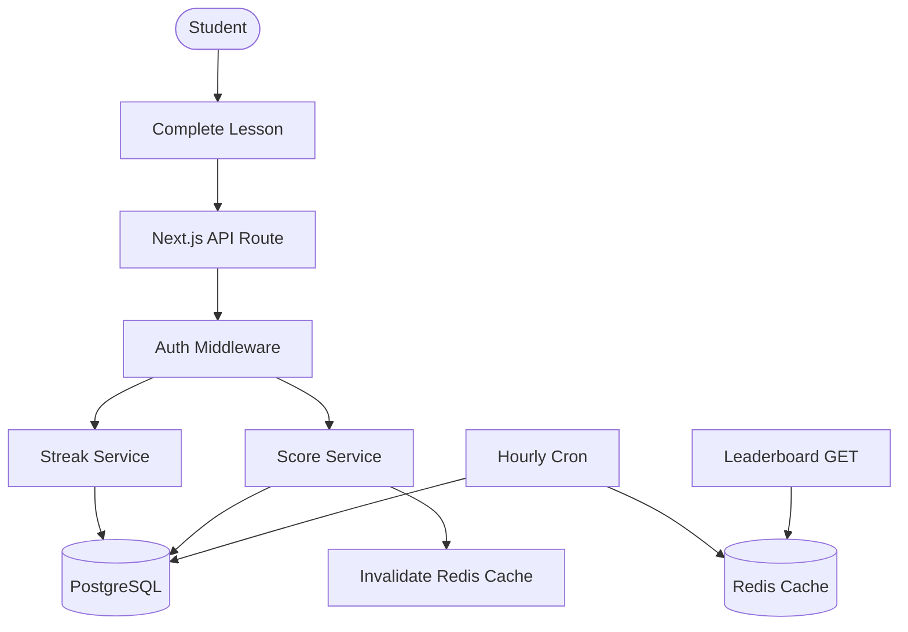

# High-Level Design (HLD)

## 1. Introduction
Cerevia is a gamification backend designed for BYJU'S to handle large-scale concurrent users interacting with Daily Streaks and Weekly Leaderboards.

## 2. Architecture Diagram

## 3. Tech Stack
- **Framework**: Next.js 15 (App Router)
- **Database**: PostgreSQL (with Prisma ORM)
- **Caching**: Redis
- **Security**: Helmet, Rate Limiting, JWT
